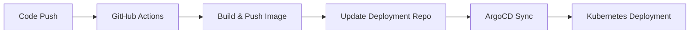

# K8s Demo Application

A containerized Python FastAPI application demonstrating modern CI/CD practices with Kubernetes deployment using GitOps methodology.

## 🏗️ Architecture

This project showcases a complete CI/CD pipeline with:
- **Application**: Python FastAPI web service
- **Containerization**: Docker with multi-stage builds
- **CI/CD**: GitHub Actions for automated builds and deployments
- **Registry**: GitHub Container Registry (GHCR)
- **Deployment**: GitOps with Kustomize and ArgoCD
- **Infrastructure**: Kubernetes with automated image updates

## 📁 Project Structure

```
k8s-demo/
├── src/
│   ├── main.py              # FastAPI application
│   └── requirements.txt     # Python dependencies
├── .github/
│   └── workflows/
│       └── docker-image.yml # CI/CD pipeline
├── Dockerfile               # Container build instructions
├── docker-compose.yaml      # Local development setup
└── README.md               # This file
```

## 🚀 Quick Start

### Local Development

1. **Clone the repository**
   ```bash
   git clone https://github.com/hustshawn/k8s-demo.git
   cd k8s-demo
   ```

2. **Run with Docker Compose**
   ```bash
   docker-compose up --build
   ```

3. **Access the application**
   - Open http://localhost:8080 in your browser
   - API documentation: http://localhost:8080/docs

### Manual Docker Build

```bash
# Build the image
docker build -t k8s-demo:latest .

# Run the container
docker run -p 8080:8080 k8s-demo:latest
```

## 🔄 CI/CD Pipeline

The project uses GitHub Actions for automated CI/CD with the following workflow:

### Pipeline Stages

1. **Build & Push** (`build-and-push` job)
   - Builds Docker image on every push/PR
   - Pushes to GitHub Container Registry (GHCR) on main branch
   - Creates both `latest` and timestamp-based tags
   - Uses format: `ghcr.io/hustshawn/k8s-demo:YYYYMMDD-HHMMSS`

2. **Trigger Deployment** (`trigger-cd` job)
   - Automatically creates PR in deployment repository
   - Updates Kustomize image tags
   - Follows GitOps best practices

### Workflow Triggers

- **Push to main**: Full CI/CD pipeline with deployment
- **Pull Requests**: Build and test only (no deployment)

### Image Tags

The pipeline creates multiple tags for flexibility:
- `latest`: Always points to the latest main branch build
- `main`: Branch-specific tag
- `YYYYMMDD-HHMMSS`: Timestamp-based tags for precise deployments

## 🏭 Deployment

### GitOps Workflow

1. **Source Repository** (this repo): Contains application code
2. **Deployment Repository**: [k8s-deploy-demo](https://github.com/hustshawn/k8s-deploy-demo)
3. **ArgoCD**: Monitors deployment repo and applies changes to Kubernetes

### Deployment Process



### Kustomize Configuration

The deployment uses Kustomize for image tag management:

```yaml
# kustomization.yaml
images:
- name: ghcr.io/hustshawn/k8s-demo
  newTag: 20250708-160000  # Updated automatically by CI/CD
```

## 🛠️ Technology Stack

| Component | Technology |
|-----------|------------|
| **Application** | Python 3.11, FastAPI, Uvicorn |
| **Containerization** | Docker, Multi-stage builds |
| **CI/CD** | GitHub Actions |
| **Container Registry** | GitHub Container Registry (GHCR) |
| **Orchestration** | Kubernetes |
| **GitOps** | ArgoCD, Kustomize |
| **Deployment** | Rolling updates, Health checks |

## 📋 Application Details

### API Endpoints

- `GET /`: Welcome message
- `GET /health`: Health check endpoint
- `GET /docs`: Interactive API documentation (Swagger UI)

### Container Specifications

- **Base Image**: `python:3.11-slim-bullseye`
- **Port**: 8080
- **Health Check**: Built-in FastAPI health endpoint
- **Resource Limits**: Configured in Kubernetes deployment

## 🔧 Configuration

### Environment Variables

| Variable | Description | Default |
|----------|-------------|---------|
| `PORT` | Application port | `8080` |
| `HOST` | Bind address | `0.0.0.0` |

### Kubernetes Resources

- **CPU Request**: 250m
- **Memory Request**: 512Mi
- **CPU Limit**: 500m
- **Memory Limit**: 512Mi

## 🚦 Monitoring & Health Checks

### Application Health

- **Liveness Probe**: `GET /health`
- **Readiness Probe**: `GET /health`
- **Startup Probe**: `GET /health`

### Deployment Status

Monitor deployment status through:
- ArgoCD UI
- Kubernetes dashboard
- `kubectl get pods -l app=backend`

## 🔐 Security

### Container Security

- Non-root user execution
- Minimal base image (slim-bullseye)
- No unnecessary packages
- Multi-stage builds for smaller attack surface

### Registry Security

- GitHub Container Registry with token authentication
- Automated vulnerability scanning
- Image signing (optional with cosign)

## 🤝 Contributing

1. Fork the repository
2. Create a feature branch: `git checkout -b feature/amazing-feature`
3. Commit changes: `git commit -m 'Add amazing feature'`
4. Push to branch: `git push origin feature/amazing-feature`
5. Open a Pull Request

### Development Workflow

1. Make changes to the application
2. Test locally with Docker Compose
3. Push to feature branch
4. Create PR (triggers build-only pipeline)
5. Merge to main (triggers full CI/CD pipeline)

## 📚 Related Repositories

- **Deployment Repository**: [k8s-deploy-demo](https://github.com/hustshawn/k8s-deploy-demo)
- **Container Images**: [GHCR Package](https://github.com/hustshawn/k8s-demo/pkgs/container/k8s-demo)

## 🐛 Troubleshooting

### Common Issues

1. **Build Failures**
   - Check GitHub Actions logs
   - Verify Dockerfile syntax
   - Ensure all dependencies are in requirements.txt

2. **Deployment Issues**
   - Check ArgoCD application status
   - Verify Kubernetes cluster connectivity
   - Review deployment repository PR status

3. **Container Registry Issues**
   - Verify GHCR token permissions
   - Check package visibility settings
   - Ensure proper authentication

### Useful Commands

```bash
# Check application logs
kubectl logs -l app=backend -f

# Check deployment status
kubectl get deployments

# Check ArgoCD application
argocd app get k8s-demo

# Manual image pull test
docker pull ghcr.io/hustshawn/k8s-demo:latest
```

## 📄 License

This project is licensed under the MIT License - see the [LICENSE](LICENSE) file for details.

## 🙏 Acknowledgments

- FastAPI for the excellent Python web framework
- GitHub Actions for reliable CI/CD
- ArgoCD for GitOps deployment automation
- Kubernetes community for container orchestration

---

**Built with ❤️ for demonstrating modern DevOps practices**
